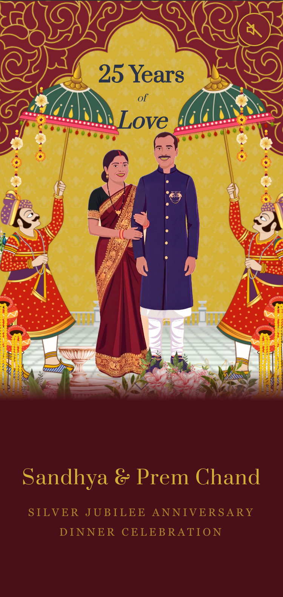
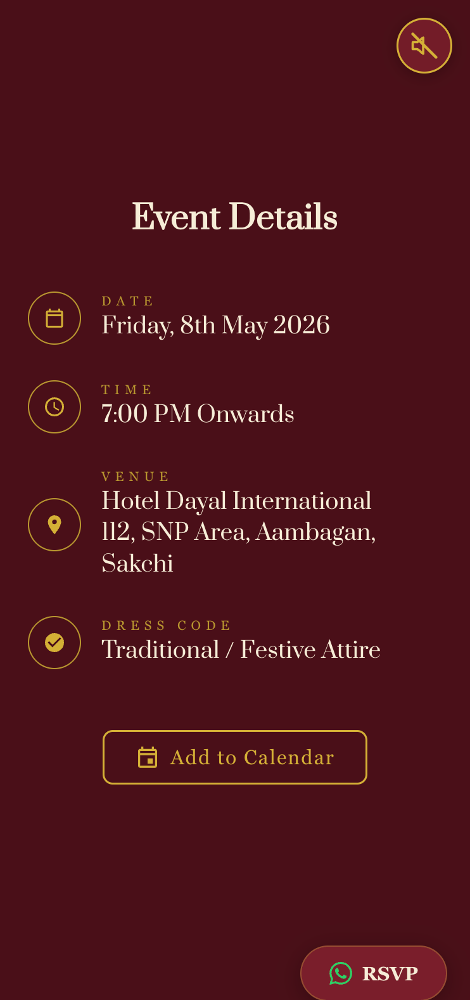
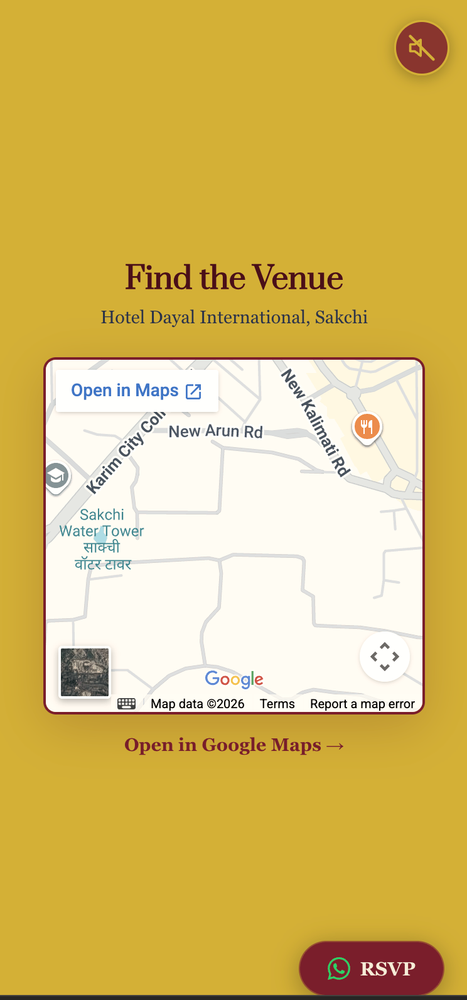
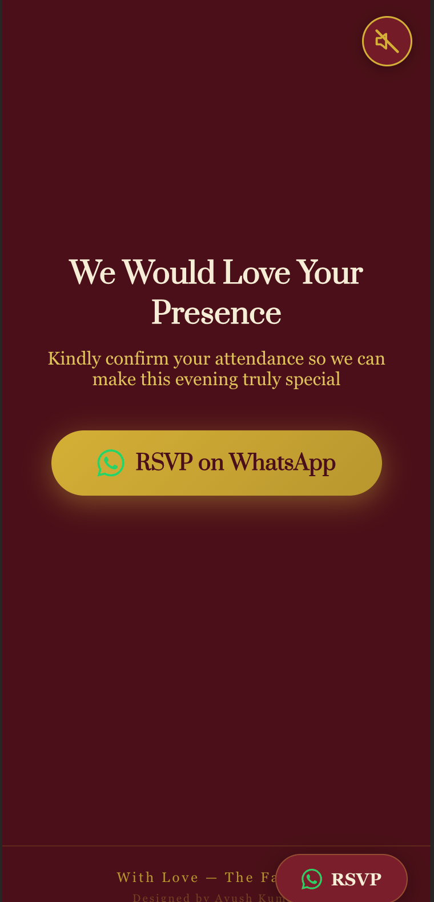

# 25 Years of Love - Silver Jubilee Anniversary Website

A mobile-first, animated wedding anniversary invitation website for Sandhya & Prem Chand's 25th Silver Jubilee Anniversary celebration.

## Screenshots

| Hero | Details | Map | RSVP |
|------|---------|-----|------|
|  |  |  |  |

## Features

- **Mobile-first design** with CSS scroll-snap for full-page sections
- **Animated couple** with real-time canvas-based chromakey video compositing
- **GSAP + ScrollTrigger** animations throughout
- **Background music** with toggle control
- **Haptic feedback** on mobile (Vibration API)
- **Add to Calendar** (Google Calendar + .ics download)
- **WhatsApp RSVP** integration
- **Google Maps** embed for venue directions
- **CSS animations** for flowers, garlands, peacocks, and couple

## Tech Stack

- Pure HTML/CSS/JS (single `index.html`)
- [GSAP](https://greensock.com/gsap/) + ScrollTrigger for animations
- Canvas API for real-time video chromakey
- Google Fonts (Prata)

## Design

- Colors: `#D4AF36` (gold) and `#7A1E2B` (maroon)
- Fonts: Prata (headings), Georgia (body)
- Hero illustration recreated from individual Canva assets with exact positioning

## Event Details

- **Date:** Friday, 8th May 2026
- **Time:** 7:00 PM Onwards
- **Venue:** Hotel Dayal International, 112, SNP Area, Aambagan, Sakchi

## Deploy

Static site - just serve the directory. Works with Netlify, Vercel, GitHub Pages, or any static host.

```bash
# Local dev
npx serve .
```

## Credits

Designed by [Ayush Kumar](https://www.linkedin.com/in/ayushkumar1808/)
